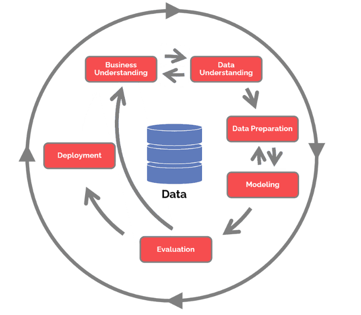

## Amazon Fine Food Reviews

 - Link for download [Dataset](https://www.kaggle.com/datasets/snap/amazon-fine-food-reviews).

## CRISP-DM Diagram

The CRoss Industry Standard Process for Data Mining (CRISP-DM) is a process model that serves as the base for a data science process. It has six sequential phases:

Inspired by [Wikipedia](https://en.wikipedia.org/wiki/Cross-industry_standard_process_for_data_mining)

- Business understanding – What does the business need?
- Data understanding – What data do we have / need? Is it clean?
- Data preparation – How do we organize the data for modeling?
- Modeling – What modeling techniques should we apply?
- Evaluation – Which model best meets the business objectives?
- Deployment – How do stakeholders access the results?
